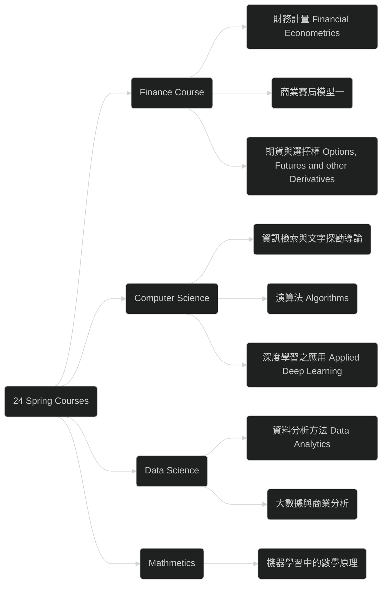

# 2024 Spring Semester Planned Taking Course

Just a `tentative` agenda. OF COURSE WE CAN NOT DO THAT!

## Overview

## Finance and Economics Course 

### 商業賽局模型一 ( Fin 7035 )

#### Information

> * Course Name: 商業賽局模型一 
* Lecturer: 陳其美
* Semester: 110-1
* NTU Cool Link: [商業賽局模型一 ( Fin 7035 )](https://cool.ntu.edu.tw/courses/7971)
{: .prompt-info }

#### Syllabus

> * 9/20 Static Games with Complete Information, I 
* 9/27 Static Games with Complete Information, II 
* 10/4 Multistage Games with Observable Actions and Repeated Games 
* 10/11 Static Games with Incomplete Information 
* 10/18 Adverse Selection and Screening Games, Part I 
* 10/25 Adverse Selection and Screening Games, Part II 
* 11/1 Signaling Games, Perfect Bayesian Equilibrium, and Some Refinements, I 
* 11/8 Signaling Games, Perfect Bayesian Equilibrium, and Some Refinements, II 
* 11/15 Midterm Exam 
* 11/22 Financial Signaling Models, I 
* 11/29 Financial Signaling Models, II 
* 12/6 Asset Trading Models, I 
* 12/13 Asset Trading Models, II 
* 12/20 Interactions between Financial and Product Markets 
* 12/27 Pricing Strategies 
* 1/3 Product Line Design, Branding and Return Policy 
* 1/10 Distribution Channels and E-commerce 
* 1/17 Oral Presentation
{: .prompt-tip }

#### Timeline

---

24 Mar. to 30 Mar.

- [x]  **Rubinstein Bargaining Game and War of Attrition**
  - [x] ngt2021nov10part3
  - [x] ngt2021nov17part1
- [x] **Infinitely Repeated Games**
  - [x] ngt2021nov17part2
  - [x] ngt2021nov17part3
  - [x] ngt2021nov17part4a
- [x] **Finitely Repeated Games**
  - [x] ngt2021nov17part4b

---

31 Mar. to 6 Apr.

- [x]  **Static Games with Incomplete Information and BE**
  - [x] ngt2021nov24part1
- [x] **Signalling Games, PBE, and Cho-Kreps Intuitive Criterion**
  - [x] ngt2021nov24part2
- [x] **Applications to Finance: Jensen-Meckling Theory, Bank Run, Aghion-Bolton Model, Hart-Moore Model**
  - [x] ngt2021dec08part1
  - [x] ngt2021dec08part2a
  - [x] ngt2021dec08part2b

---

7 Apr. to 13 Apr.

- [x] **Lecture 4: Spence Signaling Game**
  - [x] ngt2021dec08part3a
  - [x] ngt2021dec08part3b
- [x]  **Lecture 4: Screening Games: Monopolistic Nonlinear Pricing and Competitive Screening**
  - [x] ngt2021dec15part1a
  - [x] ngt2021dec15part1b
  - [x] ngt2021dec15part2
- [x]  **Lecture 4: Reputation Games (The Chain-store Paradox)**
  - [x] ngt2021dec22part1

---

14 Apr. to 20 Apr.

- [x] **Lecture 5: The Costly State Verification (CSV) Debt-Financing Model**
  - [x] ngt2021dec22part2
  - [x] ngt2021dec22part3
- [x]  **Lecture 4: Sequential Equilibrium**
  - [x] ngt2021dec29part1
- [x] **Lecture 4: Iterated Intuitive Equilibrium, Grossman-Perry Equilibrium, and Divine Equilibrium**
  - [x] ngt2021dec29part2

---

### 財務計量 ( Financial Econometrics,  Fin 3026 )

#### Information

> * Course Name: 財務計量 ( Financial Econometrics )
* Lecturer: Chih-Ching Hung
* Semester: 110-2
* NTU Cool Link: [財務計量 (Fin 3026) ](https://cool.ntu.edu.tw/courses/13240)
{: .prompt-info }

#### Syllabus

> * Week 1	2/14	Basic Regression Concepts
* Week 2	2/21	Basic Regression Concepts
* Week 3	2/28	Peace Memorial Day
* Week 4	3/07	Time Series
* Week 5	3/14	Time Series
* Week 6	3/21	Time Series
* Week 7	3/28	Time Series
* Week 8	4/04	Spring Break
* Week 9	4/11	Midterm Exam
* Week 10	4/18	Exam Review and Potential Outcome Framework (1)
* Week 11	4/25	Potential Outcome Framework (2)
* Week 12	5/02	4~5 Student Presentations
* Week 13	5/09	Matching, RCT, and Experiment (2 Presentations)
* Week 14	5/16	Instrumental Variable (2 Presentations)
* Week 15	5/23	Difference-in-Difference (2 Presentations)
* Week 16	5/30	Regression Discontinuity (2 Presentations)
{: .prompt-tip }

#### Timeline

To be finished.

### 期貨與選擇權 ( Options, Futures and other Derivatives )

> * Course Name: Options, Futures and other Derivatives
* Lecturer: Chenghsi Hsieh
* Semester: 111-2
* Course Link: [Options, Futures, and Other Derivatives](https://www.youtube.com/watch?v=-WqSRu8U9mE&list=PL8xPPUJdubH7JP6bGMM9erZTbNdPXAOTT)
{: .prompt-info }

#### Timeline

To be finished.

## Computer Science Course

### 深度學習之應用 ( Applied Deep Learning)

#### Information

> * Course Name: 深度學習之應用 ( Applied Deep Learning)
* Lecturer: 陳縕儂
* Semester: 111-1
* Course Website Link: [Applied Deep Learning 2022](https://www.csie.ntu.edu.tw/~miulab/f111-adl/)
* YouTube Video: [**2022 Fall 台大資訊 深度學習之應用 NTU CSIE ADL**](https://www.youtube.com/playlist?list=PLOAQYZPRn2V5yumEV1Wa4JvRiDluf83vn)
{: .prompt-info }

#### Syllabus

> | Date       | Description                                                  | Course Recordings                                            | Note                                                         |
| :--------- | :----------------------------------------------------------- | :----------------------------------------------------------- | :----------------------------------------------------------- |
| 2022/09/08 | [Course Logistics](https://www.csie.ntu.edu.tw/~miulab/f111-adl/doc/220908_Course.pdf) [Introduction](https://www.csie.ntu.edu.tw/~miulab/f111-adl/doc/220908_Introduction.pdf) | [0](https://youtu.be/rrw0IIEVEUo) [1.1](https://youtu.be/ONWbL9rr9Sc) [1.2](https://youtu.be/Hgtf0912_Ew) [1.3](https://youtu.be/lxa3-NpXLxU) | [PyTorch](https://www.csie.ntu.edu.tw/~miulab/f111-adl/doc/A0_PyTorch.pdf) |
| 2022/09/15 | [Neural Network Basics](https://www.csie.ntu.edu.tw/~miulab/f111-adl/doc/220915_NNBasics.pdf) [Backpropagation](https://www.csie.ntu.edu.tw/~miulab/f111-adl/doc/220915_Backprop.pdf) | [2.1](https://youtu.be/Q0l1jUy-0mA) [2.2](https://youtu.be/A83DKnpB7DM) [2.3](https://youtu.be/MbgS29j2ZsY) [2.4](https://youtu.be/Y4c8a4epz_I) [2.5](https://youtu.be/oYnJ3pmRhjk) |                                                              |
| 2022/09/22 | [Word Representation](https://www.csie.ntu.edu.tw/~miulab/f111-adl/doc/220922_WordRep.pdf) [Recurrent Neural Network](https://www.csie.ntu.edu.tw/~miulab/f111-adl/doc/220922_RNN.pdf) | [3.1](https://youtu.be/fJBbAK0Qy54) [3.2](https://youtu.be/c0N8_x-rhmE) [3.3](https://youtu.be/mRRzGVqH5lU) [3.4](https://youtu.be/9Ho2cstjMnU) |                                                              |
| 2022/09/29 | [Gating Mechanism](https://www.csie.ntu.edu.tw/~miulab/f111-adl/doc/220929_Gating.pdf) [Word Embeddings](https://www.csie.ntu.edu.tw/~miulab/f111-adl/doc/220929_WordEmbeddings.pdf) | [4](https://youtu.be/LosffMy3BqM) [5.1](https://youtu.be/K2oYKdK--9U) [5.2](https://youtu.be/j9YNHnCRkig) [5.3](https://youtu.be/4Vrd15ZwxH4) [5.4](https://youtu.be/cKor9hMjFLc) [5.5](https://youtu.be/BbTSvFwuCbo) [5.6](https://youtu.be/MnFDW20J17E) |                                                              |
| 2022/10/06 | [ELMo](https://www.csie.ntu.edu.tw/~miulab/f111-adl/doc/221006_ELMo.pdf) [Attention Mechanism](https://www.csie.ntu.edu.tw/~miulab/f111-adl/doc/221006_Attention.pdf) | [6.1](https://youtu.be/ZJD_i3g_VkA) [6.2](https://youtu.be/jISltja92vk) [7.1](https://youtu.be/YJYcMLq1_f4) [7.2](https://youtu.be/nfxai5sxm3U) |                                                              |
| 2022/10/13 | [Transformer](https://www.csie.ntu.edu.tw/~miulab/f111-adl/doc/221013_Transformer.pdf) [Subword Tokenization](https://www.csie.ntu.edu.tw/~miulab/f111-adl/doc/221013_Subword.pdf) [BERT](https://www.csie.ntu.edu.tw/~miulab/f111-adl/doc/221013_BERT.pdf) | [8.1](https://youtu.be/FbB6U_UBf8A) [8.2](https://youtu.be/of8ALg4J2oM) [8.3](https://youtu.be/KDuTjhRPjdI) [9](https://youtu.be/8dp9XGQx4vg) [10.1](https://youtu.be/XS44fSQP0-E) |                                                              |
| 2022/10/20 | [More BERT](https://www.csie.ntu.edu.tw/~miulab/f111-adl/doc/221020_MoreBERT.pdf) | [11.1](https://youtu.be/mmTy9HmDPL0) [11.2](https://youtu.be/3KyMRY89uUA) [11.3](https://youtu.be/19oog6oeuwI) [11.4](https://youtu.be/FRf9G6cbuC4) |                                                              |
| 2022/10/27 | Midterm Break                                                |                                                              |                                                              |
| 彈性補充   | [Reinforcement Learning](https://www.csie.ntu.edu.tw/~miulab/f111-adl/doc/221027_DRL.pdf) [Value-Based RL](https://www.csie.ntu.edu.tw/~miulab/f111-adl/doc/221027_ValueRL.pdf) | [11.1](https://youtu.be/pObXXUlDq94) [11.2](https://youtu.be/L08xeyNtNUk) [11.3](https://youtu.be/6a6Ljx0Lm2s) [11.4](https://youtu.be/QyLiGmUJGBM) [11.5](https://youtu.be/Ws8RIfC4AWA) [11.6](https://youtu.be/XKoYxbDJqk8) |                                                              |
| 彈性補充   | [Policy Gradient & Actor-Critic](https://www.csie.ntu.edu.tw/~miulab/f111-adl/doc/221103_PolicyRL.pdf) | [11.7](https://youtu.be/Qu2jdOLuR0U) [11.8](https://youtu.be/ApHaSpeQK1Q) |                                                              |
| 2022/11/10 | [Natural Language Generation](https://www.csie.ntu.edu.tw/~miulab/f111-adl/doc/221110_NLG.pdf) | [13.1](https://youtu.be/xOWJRJ8Cstk) [13.2](https://youtu.be/-fPRDyT8m0k) [13.3](https://youtu.be/UHx81apLn6A) [13.4](https://youtu.be/4p61x6-mwEY) |                                                              |
| 2022/11/17 | [Model Pre-Training](https://www.csie.ntu.edu.tw/~miulab/f111-adl/doc/221117_Pretraining.pdf) | [14.1](https://youtu.be/ZQ9b-1ZAT8M) [14.2](https://youtu.be/79djVKmBKF4) [14.3](https://youtu.be/fYzUbfgCQ8g) [14.4](https://youtu.be/ck4up78aV8s) [14.5](https://youtu.be/F1aq5pTL780) [14.6](https://youtu.be/_aL8Wv4SCAc) |                                                              |
| 2022/11/24 | [Prompt-Based Learning](https://www.csie.ntu.edu.tw/~miulab/f111-adl/doc/221124_PromptLearning.pdf) | [15.1](https://youtu.be/BCAtK3Cuw4E) [15.2](https://youtu.be/KgGQPmi5a9E) [15.3](https://youtu.be/gOUdm82WUqw) [15.4](https://youtu.be/Q1KVJNwAMJk) [15.5](https://youtu.be/mol6U__9520) |                                                              |
| 2022/12/01 | [Beyond Supervised Learning](https://www.csie.ntu.edu.tw/~miulab/f111-adl/doc/221201_BeyondSL.pdf) | [16.1](https://youtu.be/w9ad4vd8l-k) [16.2](https://youtu.be/CHurrTvf8yM) [16.3](https://youtu.be/cjjjhHIDjKo) [16.4](https://youtu.be/TlwL8z_9V6I) [16.5](https://youtu.be/BN2TlVoyXtY) |                                                              |
| 2022/12/08 | [Issues in Pre-Trained Models](https://www.csie.ntu.edu.tw/~miulab/f111-adl/doc/221208_Issues.pdf) | [17.1](https://youtu.be/SOAbgV07IH8) [17.2](https://youtu.be/ORHv8yKAV2Q) [17.3](https://youtu.be/TnGPmlONfI8) [17.4](https://youtu.be/e0oEpr9YkSc) |                                                              |
| 2022/12/15 | Break                                                        |                                                              |                                                              |
| 2022/12/22 | Final Break                                                  |                                                              |                                                              |
| 2022/12/29 | [Multimodality](https://www.csie.ntu.edu.tw/~miulab/f111-adl/doc/221229_Multimodality.pdf) [Sharing](https://www.csie.ntu.edu.tw/~miulab/f111-adl/doc/221229_Sharing.pdf) | [18.1](https://youtu.be/AKwl3t811tA) [18.2](https://youtu.be/Figvv2q3Gwk) [Sharing](https://youtu.be/N-ejYzQRxKM) |                                                              |
{: .prompt-tip }

#### Timeline

To be finished.

### 資訊檢索與文字探勘導論 ( IM 5030 )

#### Information

> * Course Name: 資訊檢索與文字探勘導論
* Lecturer: 陳建錦
* Semester: 112-1
* NTU Cool Link: [資訊檢索與文字探勘導論 ( IM 5030 )](https://cool.ntu.edu.tw/courses/28999)
{: .prompt-info }

#### Syllabus

#### Timeline

To be continue.

### 演算法 ( Algorithms, EE4033-01 )

#### Information

> * Course Name: 演算法 ( Algorithms )
* Lecturer: 張耀文
* Semester: 111-1
* NTU Cool Link: [演算法 ( Algorithms )](https://cool.ntu.edu.tw/courses/20243)
{: .prompt-info }

#### Syllabus

> Schedule (48 hrs in total this semester):
1. Mathematical foundations + administrative matters (6 hrs)
2. Sorting and order statistics (6 hrs)
3. Data structures: binary search trees, RB trees, interval trees (2-hr lecture **+ pre-recorded videos**)
4. Dynamic programming and greedy algorithms (9 hrs)
5. Amortized analysis (**pre-recorded videos**)
6. Graph algorithms: disjoint set, graph representations, searching, minimum spanning tree, single-source and all-pair shortest paths, network flow, matching (14 hrs)
7. NP-completeness & coping with NP-completeness (5 hrs)
8. General-purpose algorithms: simulated annealing, and machine learning, as time permits.
9. Others: Exams (6 hrs)
{: .prompt-tip }

#### Timeline

To be finished.

## Data Science

My interest is also `data science`.  Here are several Course I decided to learn.

### 資料分析方法 ( Data Analytics， IE5054 )

#### Information

> * Course Name: 資料分析方法 ( Data Analytics )
* Lecturer: CHUN-HUNG LAN
* Semester: 112-2
* NTU Cool Link: [資料分析方法 ( Data Analytics )](https://cool.ntu.edu.tw/courses/35000)
{: .prompt-info }

#### Syllabus

> |  Week   |   Due   |                  Topic                   |
 | :-----: | :-----: | :--------------------------------------: |
 | Week 1  | Feb. 19 |             Review & Preview             |
 | Week 2  | Feb. 26 |           Regression Analysis            |
 | Week 3  | Mar. 04 |           Regression Analysis            |
 | Week 4  | Mar. 11 |    Multivariate Statistical Inference    |
 | Week 5  | Mar. 18 |      Dimension Reduction Techniques      |
 | Week 6  | Mar. 25 |     Partial Least Squares Regression     |
 | Week 7  | Apr. 01 | Big Data Infrastructure × Team Building* |
 | Week 8  | Apr. 08 |              Mid-term Exam               |
 | Week 9  | Apr. 15 |      Supervised Learning Algorithms      |
 | Week 10 | Apr. 22 |      Supervised Learning Algorithms      |
 | Week 11 | Apr. 29 |     Unsupervised Learning Algorithms     |
 | Week 12 | May 06  |     Unsupervised Learning Algorithms     |
 | Week 13 | May 13  |       Machine Learning Techniques        |
 | Week 14 | May 20  |             Deep Neural Nets             |
 | Week 15 | May 27  |             Deep Neural Nets             |
 | Week 16 | Jun. 03 | Project Presentation Day (Peer Review*)  |
 | Week 17 | Jun. 07 |                Report Due                |
{: .prompt-tip }

#### Timeline

### 大數據與商業分析 (IM5047)

> * Course Name: 大數據與商業分析 ( IM5047 )
* Lecturer:  楊立偉
* Semester: 112-2
* NTU Cool Link: [大數據與商業分析 ( IM5047 )](https://cool.ntu.edu.tw/courses/34447)
{: .prompt-info }

#### Syllabus

> | 週次                      | 主題                                 | 投影片                                                       |
| ------------------------- | ------------------------------------ | ------------------------------------------------------------ |
| Week 01 (2024.02.21) 實體 | Introduction 課程及修課說明          | [簡介](https://homepage.ntu.edu.tw/~wyang/bda2024/slides/bda2024_intro.pdf) 之後請至[ntu cool](https://cool.ntu.edu.tw/courses/34447) |
| Week 02 (2024.02.28) 放假 | L1: Text mining                      | 作業1                                                        |
| Week 03 (2024.03.06) 線上 | L2: Web mining                       |                                                              |
| Week 04 (2024.03.13) 實體 | L3: Classification                   |                                                              |
| Week 05 (2024.03.20) 線上 | L4: Clustering                       |                                                              |
| Week 06 (2024.03.27) 實體 | 期中專題說明                         |                                                              |
| Week 07 (2024.04.03) 實體 | 實習/L5: Sequence Tagging            |                                                              |
| Week 08 (2024.04.10) 線上 | L6: Language Processing              |                                                              |
| Week 09 (2024.04.17) 線上 | Special Issue: Gen AI & applications |                                                              |
| Week 10 (2024.04.24) 實體 | 期中報告                             |                                                              |
| Week 11 (2024.05.01) 實體 | E-Commerce Analytics (1)             |                                                              |
| Week 12 (2024.05.08) 實體 | E-Commerce Analytics (2)             | 期末專題說明                                                 |
| Week 13 (2024.05.15) 線上 | E-Commerce Analytics (3)             |                                                              |
| Week 14 (2024.05.22) 實體 | 期末Proposal/討論回饋                |                                                              |
| Week 15 (2024.05.29) 線上 | Special Issue: Social Data Analytics |                                                              |
| Week 16 (2024.06.05) 實體 | 期末報告                             |                                                              |
{: .prompt-tip }

#### Timeline

To be finished.

## Mathematics

### 機器學習中的數學原理 ( COMME5051 )

#### Information

> * Course Name: 機器學習中的數學原理 ( COMME5051 )
* Lecturer:  I-Hsiang Wang
* Semester: 110-1
* NTU Cool Link: [機器學習中的數學原理 ( COMME5051 )](https://cool.ntu.edu.tw/courses/9214)
{: .prompt-info }

#### Syllabus

To be finished.

#### Timeline

To be finished.
